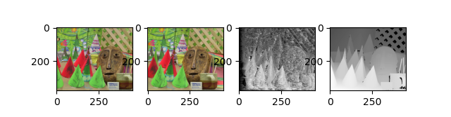
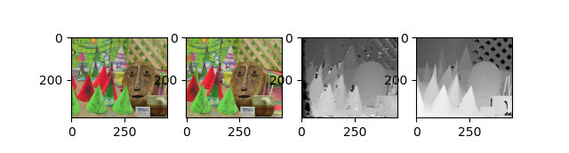
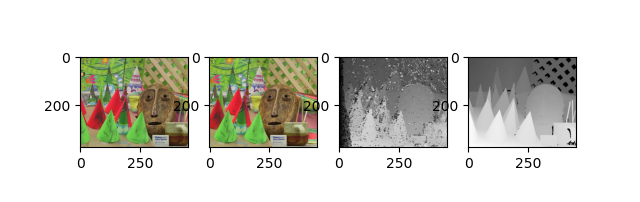

# StereoMatchingWithPyopencl
Find correspondence between 2 views(left &amp; right) with traditional stereo matching algorithms using GPGPU

4 cost-metrics are implemented.

$$
ABS\_DIFF(f, g, d_{i}) = |f_{r,c} - g_{r,c+d_{i}}| \\

SAD(f, g, d_{i}) = \frac{1}{w^2}\sum_{m=-w/2}^{w/2}\sum_{n=-w/2}^{w/2}|F - G| \ \ \ \     where \ F = f_{r+m,\ c+n}\ , \ G=g_{r+m,\ c+n+d_{i}}\\

NCC(f,g, d_{i}) = \sum_{m=-w/2}^{w/2}\sum_{n=-w/2}^{w/2} \frac{(F - F_\mu)(G - G_\mu)}{(F-F_\mu)^2(G-G_\mu)^2} \ \ \ \     where \ F_\mu = F_{mean}\ , \ G_\mu=G_{mean} \\

ZNCC(f,g,d_{i}) = \sum_{m=-w/2}^{w/2}\sum_{n=-w/2}^{w/2} \frac{(F - F_\mu)(G - G_\mu)}{F_\sigma G_\sigma} \ \ \ \     where \ F_\sigma = F_{std}\ , \ G_\sigma=G_{std} \\
$$

### Experimental Results

I tested Middlebury Cones dataset with RTX 2080ti.

#### ABS_diff

#### SAD

#### NCC

#### ZNCC

| cost function | MSE    | BP     | Elapsed time |
| ------------- | ------ | ------ | ------------ |
| ABS_DIFF      | 143.24 | 47.05% | 17.95 ms     |
| SAD (7x7)     | 17.90  | 10.22% | 20.515 ms    |
| NCC (7x7)     | 24.96  | 9.08%  | 39.40 ms     |
| ZNCC (7x7)    | 38.11  | 11.73% | 62.83 ms     |

