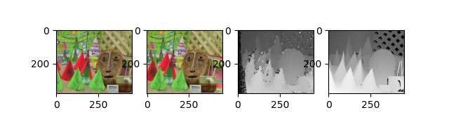

# StereoMatchingWithPyopencl
Find correspondence between 2 views(left &amp; right) with traditional stereo matching algorithms using GPGPU

4 cost-metrics are implemented.

### Experimental Results

I tested Middlebury Cones dataset with RTX 2080ti.

#### ABS_diff

#### SAD

#### NCC

#### ZNCC

| cost function | MSE    | BP     | Elapsed time |
| ------------- | ------ | ------ | ------------ |
| ABS_DIFF      | 143.24 | 47.05% | 17.95 ms     |
| SAD (7x7)     | 17.90  | 10.22% | 20.515 ms    |
| NCC (7x7)     | 24.96  | 9.08%  | 39.40 ms     |
| ZNCC (7x7)    | 38.11  | 11.73% | 62.83 ms     |

